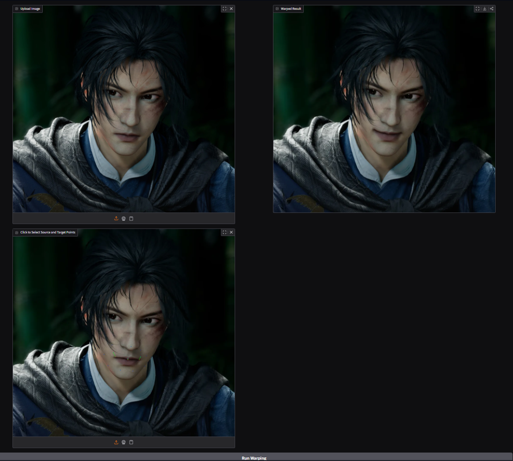
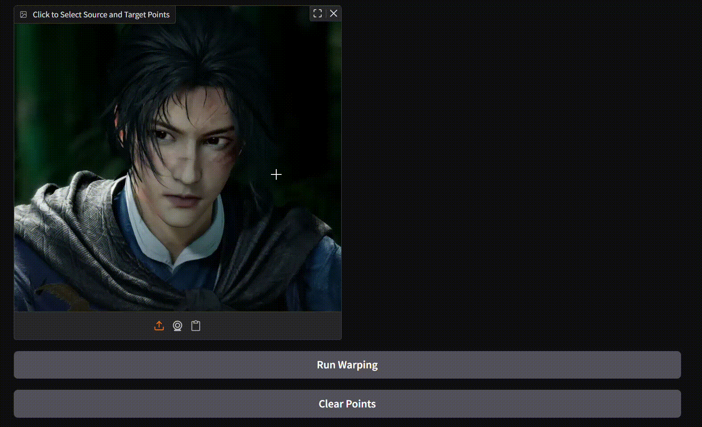

# Assignment 1 - Image Warping

## Implementation of Image Geometric Transformation

This repository is Kamila Wilczyńska's implementation of Assignment_01 of DIP. 



## Requirements

To install requirements:

```setup
python -m pip install -r requirements.txt
```

## Running

To run basic transformation, run:

```basic
python run_global_transform.py
```

To run point guided transformation, run:

```point
python run_point_transform.py
```

## Results (need add more result images)
### Basic Transformation


### Point Guided Deformation:


#### Point Guided Deformation Points Removal:


#### Point Guided Deformation Incorrect Points Amount Warning:


## Acknowledgement

### Resources:
- [Teaching Slides](https://pan.ustc.edu.cn/share/index/66294554e01948acaf78) 
- [Paper: Image Deformation Using Moving Least Squares](https://people.engr.tamu.edu/schaefer/research/mls.pdf)
- [OpenCV Geometric Transformations](https://docs.opencv.org/4.x/da/d6e/tutorial_py_geometric_transformations.html)
- [Gradio: 一个好用的网页端交互GUI](https://www.gradio.app/)

>📋 Thanks for the algorithms proposed by [Image Deformation Using Moving Least Squares](https://people.engr.tamu.edu/schaefer/research/mls.pdf).
