# Assignment 2 - DIP with PyTorch

This repository is Kamila Wilczyńska's implementation of Assignment_02 of DIP.

## Requirements

To install requirements:

```setup
python -m pip install -r requirements.txt
```

## Task 1 — Poisson Image Blending with PyTorch

### Running

To run Poisson image editing:
```setup
python run_blending_gradio.py
```
The provided code will train the model on the [Facades Dataset](https://cmp.felk.cvut.cz/~tylecr1/facade/).

### Overview

This task implements an interactive Poisson Image Blending system using Gradio and PyTorch.
Users can manually select a polygon region from a foreground image and seamlessly blend it into a background image using gradient-domain optimization.

The overall workflow is:

1. User uploads foreground and background images.
2. User clicks on the foreground image to define a polygon region.
3. Polygon is closed and converted into a binary mask.
4. The mask is shifted to the target location using (dx, dy).
5. A blended image is initialized from the background.
6. Optimization is performed using Laplacian loss and boundary constraint.
7. Final blended result is displayed.

### Key Components

**A binary mask is created from user-defined polygon:**
- Inside polygon: 255
- Outside polygon: 0
- Laplacian Loss

**Gradient consistency is enforced using a Laplacian kernel:**

$\begin{bmatrix}0 &1 & 0\\1 & -4 & 1\\0 &1 &0 \end{bmatrix}$

**Loss:**
- L = MSE(Laplace(F), Laplace(B)) + boundary constraint
- Optimization
- Optimizer: Adam
- Iterations: 5000
- Learning rate: 1e-2 (decayed during training)
- Only masked region is optimized

**Gradio UI supports:**
- Foreground image + polygon selection
- Background image upload
- dx / dy position control
- Real-time blending result
- Outputs
- Foreground with polygon overlay
- Background preview with shifted mask
- Final blended image

### Results

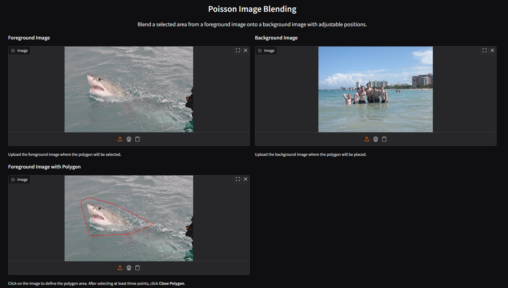
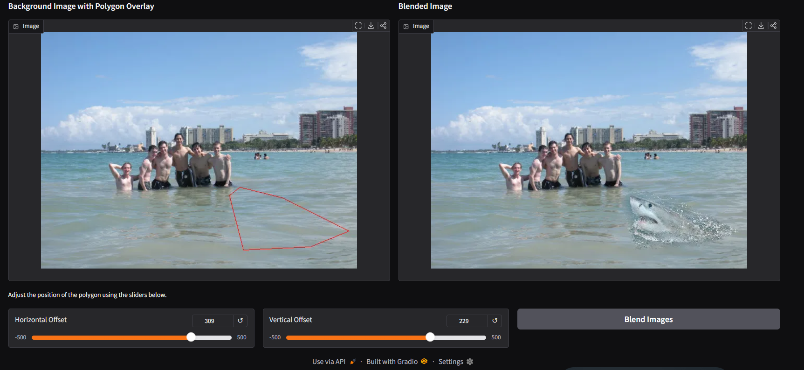
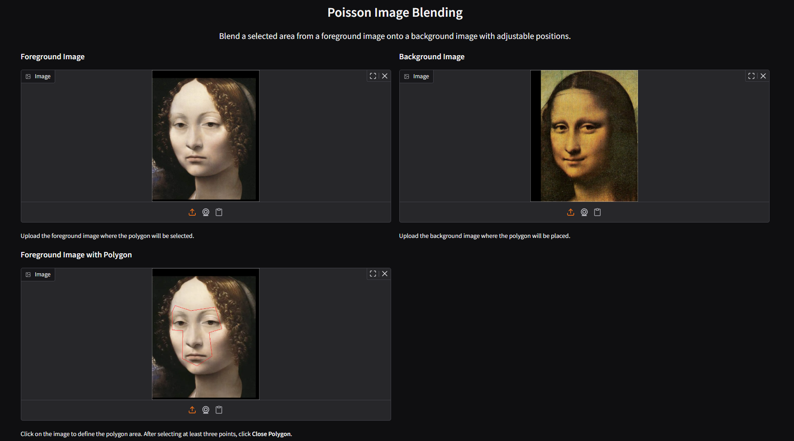
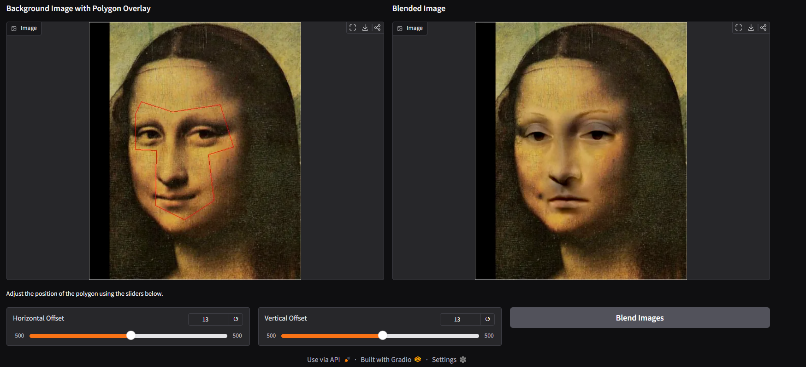

## [Pix2Pix](https://phillipi.github.io/pix2pix/) with [Fully Convolutional Layers](https://arxiv.org/abs/1411.4038)

### Running

To run Pix2Pix training, enter Pix2Pix folder and run:
```bash
bash download_facades_dataset.sh
python train.py
```

### Overview

This task implements a Fully Convolutional Network (FCN) for image-to-image translation using the Facades dataset.
The model learns a direct mapping from RGB facade images to their corresponding semantic labels using supervised learning.
Dataset: [Facades Dataset](https://cmp.felk.cvut.cz/~tylecr1/facade/) (400 train / 100 val)

### Model Architecture

The network is a simple encoder–decoder FCN.

**Encoder (Downsampling):**
- 3 - 8 - 16 - 32 - 64
- Conv2d + BatchNorm + ReLU
- Stride = 2 for spatial downsampling

**Decoder (Upsampling):**
- 64 - 32 - 16 - 8 - 3
- ConvTranspose2d + BatchNorm + ReLU
- Final activation: Tanh

### Training Setup
- Dataset: Facades (400 train / 100 val)
- Loss: L1 Loss
- Optimizer: Adam (lr = 0.001, betas = (0.5, 0.999))
- Scheduler: StepLR (step=200, gamma=0.2)
- Epochs: 501
- Batch size: 100 

### Training Pipeline
For each batch:
- Forward pass through FCN
- Compute L1 loss
- Backpropagation + Adam update

Validation runs without gradients and reports average loss.

### Outputs

Every 5 epochs, results are saved in:

- `train_results/`
- `val_results/`

Model weights are saved every 50 epochs in:

- `checkpoints/pix2pix_model_epoch_X.pth`

### Results

Selected results produced during the training process:  

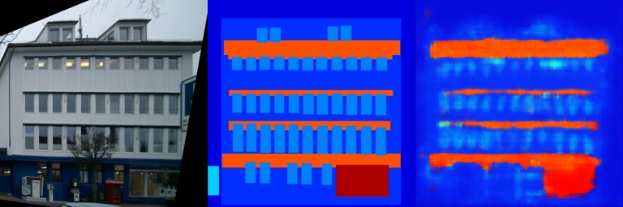
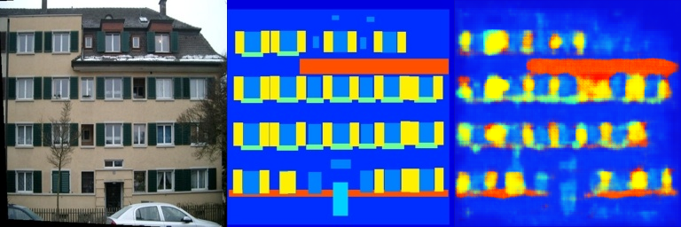
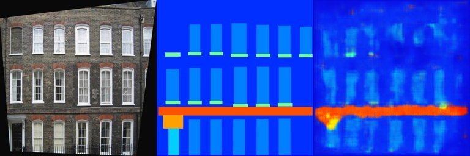
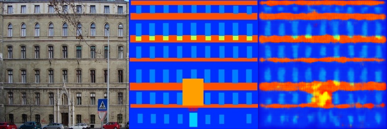
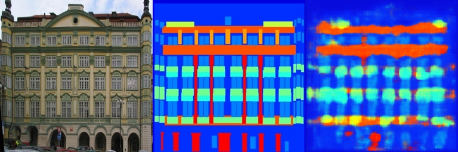

Selected results generated by the model on the validation set:  

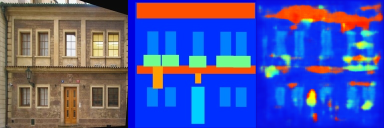
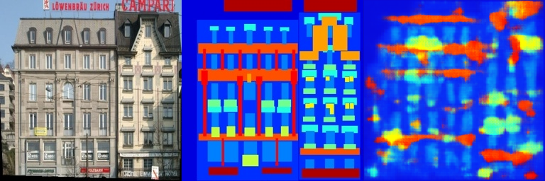
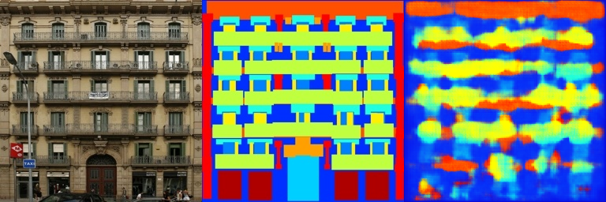
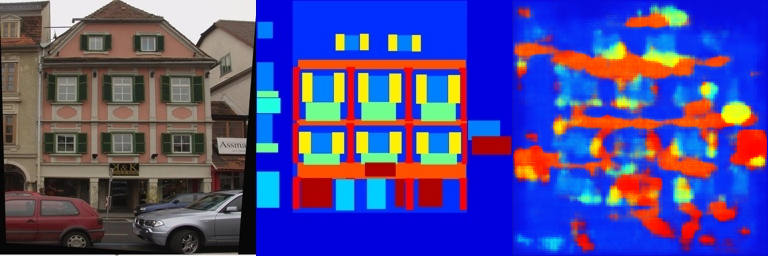
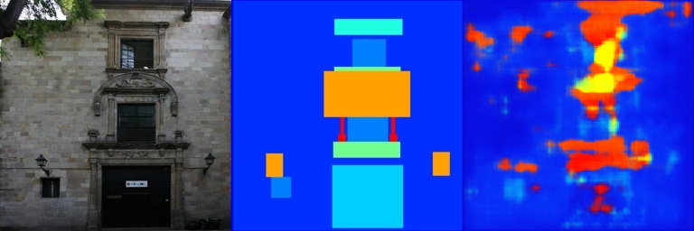

## Resources:
- [Assignment Slides](https://pan.ustc.edu.cn/share/index/66294554e01948acaf78)  
- [Paper: Poisson Image Editing](https://www.cs.jhu.edu/~misha/Fall07/Papers/Perez03.pdf)
- [Paper: Image-to-Image Translation with Conditional Adversarial Nets](https://phillipi.github.io/pix2pix/)
- [Paper: Fully Convolutional Networks for Semantic Segmentation](https://arxiv.org/abs/1411.4038)
- Dataset citation:
@INPROCEEDINGS{Tylecek13,
  author = {Radim Tyle{\v c}ek and Radim {\v S}{\' a}ra},
  title = {Spatial Pattern Templates for Recognition of Objects with Regular Structure},
  booktitle = {Proc. GCPR},
  year = {2013},
  address = {Saarbrucken, Germany},
}
