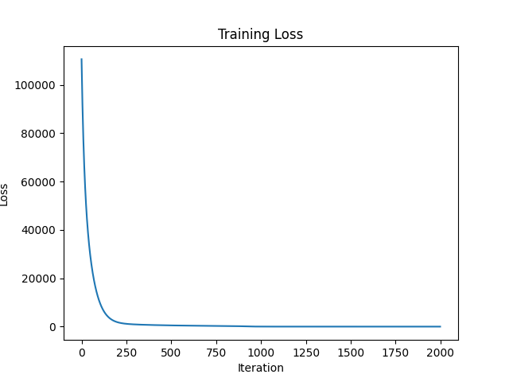
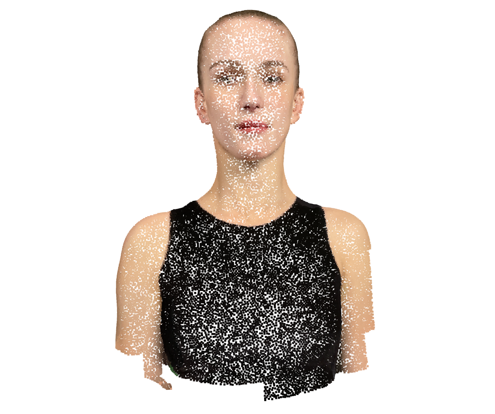
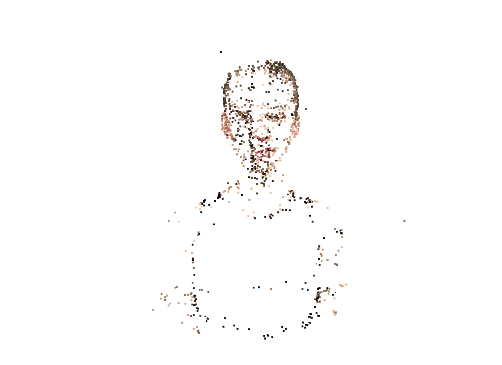

# Assignment 3 - Bundle Adjustment

This repository is Kamila Wilczyńska's implementation of Assignment_03 of DIP.

---

## Overview

The goal of this assignment is to solve a classical **Structure-from-Motion (SfM)** problem.

Given only 2D observations of a 3D object from multiple views, we aim to recover:

- A shared camera focal length \( f \)
- Camera extrinsics (rotation \( R \) and translation \( T \)) for each view
- 3D coordinates of all observed points

The project consists of two main parts:

1. Task 1: Implement Bundle Adjustment from scratch using PyTorch  
2. Task 2: Perform full 3D reconstruction using COLMAP

---

## Environment

The implementation was tested in the following environment:

- Python 3.10
- PyTorch  
- NumPy  
- Matplotlib  
- OpenCV (for visualization utilities)  
- COLMAP (for Task 2)

A virtual environment (e.g., Conda or venv) is recommended.

---

## Data

The dataset consists of 50 views and 20,000 points sampled from a 3D head model.

```
data/
├── images/              # 50 rendered views (1024×1024), for visualization & COLMAP
├── points2d.npz         # 2D observations: 50 keys ("view_000" ~ "view_049"), each (20000, 3)
└── points3d_colors.npy  # per-point RGB colors (20000, 3), for result visualization
```

Each entry in `points2d.npz` has shape `(20000, 3)` of `(x, y, visibility)`：
- `x, y`：pixel coordinates
- `visibility`：1 (visible) or 0 (occluded)

---

**Multi-view images & 2D projections:**


## Known Information

| Parameter     | Value         | Description |
|--------------|--------------|------------|
| Image Size    | 1024 × 1024  | Resolution |
| Num Views     | 50           | Cameras |
| Num Points    | 20000        | 3D points |

---

# Task 1 - Bundle Adjustment with PyTorch

## Objective

We aim to estimate:

- **Camera intrinsics**  
   - Shared focal length \( f \)

- **Camera extrinsics**  
   - Rotation \( R \)  
   - Translation \( T \)

- **3D structure**  
   - 20,000 points \( (X, Y, Z) \)

The objective is to minimize the reprojection error between predicted and observed 2D points.

---

## Methodology

### Data Processing

- Input file: `points2d.npz`
- Data is organized into tensors of shape:
  - \( (V, N, 2) \) for coordinates
  - \( (V, N) \) for visibility mask

Only visible points contribute to the loss.

---

### Camera Model

We use a standard pinhole camera model:

\[
u = -f \cdot \frac{X_c}{Z_c} + c_x, \quad
v = f \cdot \frac{Y_c}{Z_c} + c_y
\]

where:

\[
[X_c, Y_c, Z_c] = R \cdot X + T
\]

Key observations:

- The object is located at the origin
- Cameras are positioned along the +Z axis facing the object
- Therefore, valid points satisfy \( Z_c < 0 \)

---

### Parameterization

- Rotation: Euler angles (XYZ convention)
- Translation: 3D vectors
- Focal length: single scalar parameter
- 3D points: learnable tensor

---

### Optimization

- Loss: Mean Squared Error (MSE) of reprojection
- Visibility mask applied
- Optimizer: Adam
- All parameters optimized jointly:
  \[
  \{ f, R, T, X \}
  \]

---

### Initialization Strategy

- 3D points initialized near origin
- Rotations initialized to identity
- Translations initialized to \([0, 0, -2.5]\)
- Focal length initialized to 800

This initialization ensures a reasonable starting geometry.

---

## Running the Code

To run Bundle Adjustment:

```bash
python bundle_adjustment_pytorch.py
```

---

## Outputs

The implementation produces:

- `result.obj`
- Reconstructed 3D point cloud with RGB colors
- loss_curve.png
- Training loss over iterations
- On-screen 3D visualization (Matplotlib)

---

## Results

**Convergence**

- The loss decreases steadily during optimization
- Indicates successful minimization of reprojection error



**Reconstruction Quality**

- The recovered point cloud forms a coherent 3D head shape
- Structure is visually consistent with input data




## Task 2: 3D Reconstruction with COLMAP

### Objective

In this task, we use COLMAP to perform a full Structure-from-Motion (SfM) pipeline on the provided multi-view dataset.

The goal is to reconstruct:

- Camera intrinsic parameters (focal length and calibration)
- Camera extrinsics (rotation and translation for each view)
- Sparse 3D point cloud of the object

This provides a strong baseline for comparison with the PyTorch-based Bundle Adjustment implemented in Task 1.

---

### Pipeline Overview

The COLMAP reconstruction pipeline consists of the following steps:

1. Feature Extraction  
2. Feature Matching  
3. Sparse Reconstruction (Structure-from-Motion + Bundle Adjustment)  
4. Export reconstructed model to PLY format  
5. Visualization using Open3D  

All steps are automated using:

```bash
run_colmap.sh
```

---

### Implementation Details
**Feature Extraction**

SIFT features are extracted from all input images.

Key settings:

- Camera model: PINHOLE
- Shared intrinsic parameters (single_camera = 1)
- GPU disabled for compatibility

Results are stored in `data/colmap/database.db`.

**Feature Matching**

Exhaustive matching is performed:

- All image pairs are matched
- Feature correspondences are stored in the database

This step builds the foundation for 3D reconstruction.

**Sparse Reconstruction (Mapper)**

COLMAP performs Structure-from-Motion, which includes:

- Initial pose estimation
- Incremental reconstruction
- Internal Bundle Adjustment optimization

Output directory:

`data/colmap/sparse/0/`

Generated files:

- `cameras.bin`, camera intrinsics
- `images.bin`, camera poses (R, T)
- `points3D.bin`, sparse 3D structure
- `sparse.ply`, reconstructed 3D point cloud

---

### How to Run

Run the full pipeline using:

`bash run_colmap.sh`

This executes:

- Feature extraction
- Feature matching
- Sparse reconstruction
- PLY export

A custom viewer is provided in:

`colmap_view.py`

Run it using:

`python colmap_view.py --ply FILEPATH`

where FILEPATH is the path to the ply file (default data/colmap/sparse/0/sparse.ply).

---

### Result

- COLMAP successfully registers all views
- Built-in Bundle Adjustment significantly improves robustness
- Sparse reconstruction is sufficient for global structure recovery
- Dense reconstruction was not executed due to hardware limitations



---

## Conclusion

### Task 1

- The optimization successfully minimizes reprojection error using gradient-based methods.
- Jointly optimizing 3D structure, camera poses, and focal length is highly non-convex and sensitive to initialization.
- The use of a visibility mask is critical to avoid incorrect gradients from occluded points.
- The reconstructed geometry is visually correct, but:
  - Absolute scale is not recoverable (scale ambiguity)
  - Focal length and scene depth are coupled
- Training stability depends on:
  - Proper initialization
  - Learning rate selection
  - Numerical stability (e.g., division by small \( Z_c \))

### Task 2

- COLMAP provides a highly optimized and robust SfM pipeline.
- Unlike the PyTorch implementation, it:
  - Uses sophisticated feature matching (SIFT)
  - Applies advanced optimization strategies for Bundle Adjustment
  - Handles outliers and noise effectively
- The reconstruction is:
  - More stable
  - Less sensitive to initialization
  - More accurate in terms of reprojection error

### Key takeaways

- Bundle Adjustment is a powerful but challenging optimization problem
- Joint estimation of camera parameters and 3D structure introduces ambiguities (e.g., scale)
- Practical systems like COLMAP significantly outperform naive implementations due to better optimization strategies and feature processing
- Understanding both approaches provides a strong foundation for 3D vision and multi-view geometry

---

## Resources
- [Teaching Slides](https://pan.ustc.edu.cn/share/index/66294554e01948acaf78)
- [Bundle Adjustment — Wikipedia](https://en.wikipedia.org/wiki/Bundle_adjustment)
- [PyTorch Optimization](https://pytorch.org/docs/stable/optim.html)
- [pytorch3d.transforms](https://pytorch3d.readthedocs.io/en/latest/modules/transforms.html)
- [COLMAP Documentation](https://colmap.github.io/)
- [COLMAP Tutorial](https://colmap.github.io/tutorial.html)

---

## Citation
@inproceedings{schoenberger2016sfm,
    author={Sch\"{o}nberger, Johannes Lutz and Frahm, Jan-Michael},
    title={Structure-from-Motion Revisited},
    booktitle={Conference on Computer Vision and Pattern Recognition (CVPR)},
    year={2016},
}

@inproceedings{schoenberger2016mvs,
    author={Sch\"{o}nberger, Johannes Lutz and Zheng, Enliang and Pollefeys, Marc and Frahm, Jan-Michael},
    title={Pixelwise View Selection for Unstructured Multi-View Stereo},
    booktitle={European Conference on Computer Vision (ECCV)},
    year={2016},
}
