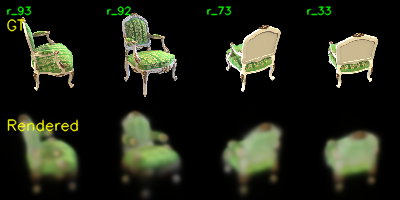
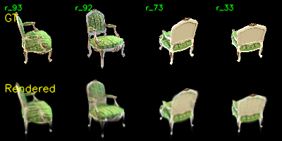
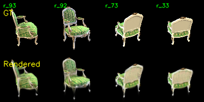
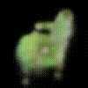

# Assignment 4 - Implement Simplified 3D Gaussian Splatting

### This repository is Kamila Wilczyńska's implementation of Assignment_04 of DIP.

---

This repository contains a pure PyTorch implementation of a simplified 3D Gaussian Splatting (3DGS) pipeline for novel view synthesis and scene reconstruction from multi-view images.

The goal is to provide a clear and educational implementation of the complete 3DGS pipeline using only PyTorch.

---

# Features

Pipeline Components:

* Structure-from-Motion using COLMAP for camera pose estimation and sparse point cloud generation
* Gaussian parameter initialization from COLMAP sparse points
* Quaternion-based rotation for 3D Gaussian orientation
* Covariance matrix construction with differentiable parameterization
* Perspective projection of 3D Gaussians to 2D image plane
* Differentiable alpha compositing for image rendering
* End-to-end optimization with gradient-based parameter updates

Training & Visualization:

* Training visualization with ground-truth comparisons
* Automatic checkpointing at configurable intervals
* Multi-view rendering video generation with orbital camera paths
* Comprehensive training statistics collection (PSNR, FPS, memory usage, etc.)

---

# Project Structure

```text
.
├── gaussian_model.py               # 3D Gaussian parameterization & covariance
├── gaussian_renderer.py            # Projection, rasterization & compositing
├── train.py                        # Main training script
├── data_utils.py                   # Dataset loading & preprocessing
├── mvs_with_colmap.py              # COLMAP reconstruction pipeline
├── debug_mvs_by_projecting_pts.py  # Point cloud validation
├── render_3dgs_mv.py               # Video rendering from trained model
│
├── data/                           # Scene data directory
│   ├── chair/                      # Chair scene (100 images)
│   └── lego/                       # Lego scene (placeholder)
│
└── checkpoints/                    # Saved model checkpoints
```

---

# Pipeline Overview

The reconstruction pipeline consists of stages:

```text
Multi-view Images
        │
        ▼
     COLMAP
        │
        ▼
 Sparse Point Cloud
        │
        ▼
3D Gaussian Initialization
        │
        ▼
Differentiable Rendering
        │
        ▼
Gradient-Based Optimization
```

---

## How It Works

### 1. 3D Gaussian Parameterization

Each Gaussian is parameterized by:

| Parameter | Symbol | Description |
|-----------|--------|-------------|
| Position | `μ` | 3D center in world coordinates |
| Rotation | `R` | Orientation represented as quaternion |
| Scale | `S` | 3D scaling factors along local axes |
| Opacity | `o` | Transparency (sigmoid-activated) |
| Color | `c` | RGB color (sigmoid-activated) |

The 3D covariance matrix is constructed from rotation and scaling:

```
Σ = R · S · Sᵀ · Rᵀ
```

where `R` is derived from the quaternion and `S` is a diagonal scaling matrix. This ensures the covariance remains positive semi-definite throughout optimization.

### 2. Projection to Camera Space

Each Gaussian is transformed from world to camera coordinates:

```
μ_cam = R_w2c · μ_world + t
```

The projection to the image plane is performed using the pinhole camera model:

```
u = f_x · x_cam / z_cam + c_x
v = f_y · y_cam / z_cam + c_y
```

### 3. 2D Covariance Projection

The 3D covariance is projected to 2D using the Jacobian of the perspective projection:

```
Σ_2D = J · R_w2c · Σ_3D · R_w2cᵀ · Jᵀ
```

where `J` is the Jacobian matrix:

```
J = [ f_x/z     0    -f_x·x/z² ]
    [   0     f_y/z  -f_y·y/z² ]
```

### 4. Gaussian Evaluation

For each pixel `p`, the contribution of a projected Gaussian is computed as:

```
G(p) = 1 / (2π · √|Σ_2D|) · exp(-½ · (p-μ_2D)ᵀ · Σ_2D⁻¹ · (p-μ_2D))
```

The implementation uses explicit 2×2 matrix inversion for numerical stability and performance.

### 5. Alpha Compositing

Gaussians are sorted by depth (front-to-back) and composited using alpha blending:

**Per-Gaussian alpha:**
```
α_i = opacity_i · G_i(p)
```

**Transmittance accumulation:**
```
T_i = ∏_{j<i} (1 - α_j)
```

**Final pixel color:**
```
C = Σ_i T_i · α_i · c_i
```

This formulation ensures proper occlusion handling and depth ordering.

### 6. Memory Optimization

To manage GPU memory (especially on limited hardware), the renderer implements:
- **View frustum culling**: Rejects Gaussians outside the camera frustum
- **Chunked rendering**: Processes Gaussians in batches to avoid allocating massive tensors
- **Checkpointing**: Reduces memory during backpropagation

---

# Task 1: Structure-from-Motion with COLMAP

COLMAP is used to estimate camera intrinsics, camera extrinsics and sparse 3D points.

Run:

```bash
python mvs_with_colmap.py --data_dir data/chair
```

The generated sparse reconstruction can be verified by projecting reconstructed points back into the training images:

```bash
python debug_mvs_by_projecting_pts.py --data_dir data/chair
```

Output:

```text
data/chair/
├── images/                    # Input images
└── sparse/                    # COLMAP reconstruction
    └── 0/
        ├── cameras.bin        # Camera parameters
        ├── images.bin         # Image metadata & poses
        └── points3D.bin       # Sparse 3D points
```

### Results
For the `chair` scene:
- **Registered images:** 100/100
- **Sparse 3D points:** 14,361
- **Camera model:** PINHOLE
- **Resolution:** 800 × 800 (downsampled to 100 × 100 during training)

All images were successfully registered with consistent camera parameter estimates.

---

# Task 2: Simplified 3D Gaussian Splatting

Each COLMAP point is converted into a learnable 3D Gaussian.

Run:

```bash
python train.py \
    --colmap_dir data/chair \
    --checkpoint_dir data/chair/checkpoints
```

---
### Training Configuration
| Parameter | Value |
|-----------|-------|
| Scene | chair |
| Training images | 100 |
| Batch size | 1 |
| Epochs | 60 |
| Iterations per epoch | 100 |
| Training resolution | 100 × 100 (8× downsampled) |
| Checkpoint interval | Every 20 epochs |
| Debug image interval | Every epoch |

### Training Outputs

#### Checkpoints
```
checkpoints/
├── checkpoint_000000.pt    # Initial state
├── checkpoint_000020.pt    # After 20 epochs
├── checkpoint_000040.pt    # After 40 epochs
└── ...
```

#### Debug Images
Ground-truth vs. rendered images saved as:
```
checkpoints/debug_images/
├── epoch_0000.png
├── epoch_0020.png
├── epoch_0040.png
└── epoch_0059.png
```
Each image shows ground truth (top) and rendered result (bottom).

**Epoch 0 (Initialization)**
<figure>
  
</figure>

**Epoch 10**
<figure>
  
</figure>

**Epoch 20**
<figure>
  
</figure>

---

# Rendering a Video

After training:

```bash
python render_3dgs_mv.py \
    --colmap_dir data/chair \
    --checkpoint checkpoints/checkpoint_000020.pt
```

Output:



The camera follows a circular orbit around the reconstructed scene.

---

### Training Statistics

The trainer records comprehensive performance metrics:

```
============================================================
TRAINING SUMMARY
============================================================
Gaussians          : 14,361
Training time      : 20543.14 sec
Training time      : 342.39 min
Iterations         : 2100
Iter/sec           : 0.10
Model size         : 0.73 MB
Peak RAM           : 10270.11 MB
Render time/image  : 3.3183 sec
FPS                : 0.30
PSNR               : 18.42 dB
============================================================
```

---

## Task 3: Comparison with Official 3DGS

This implementation is intended for educational purposes and differs significantly from the official 3DGS system.
The CUDA was not implemented due to hardware issues.

As a result, training is significantly slower, memory usage is higher, rendering quality is lower and real-time rendering is not achievable.

However, the implementation exposes the complete mathematical pipeline in a compact and readable PyTorch codebase.

### Comparison Matrix

| Aspect | This Implementation | Official 3DGS |
|--------|---------------------|---------------|
| **Resolution** | 100 × 100 (8× downsampled) | 800 × 800 (original) |
| **Rasterization** | PyTorch tensor operations with chunking | CUDA tile-based rasterizer |
| **Gaussian Count** | Fixed: 14,361 | Adaptive: 31,863 → 454,959 |
| **Color Model** | Single RGB per Gaussian | Spherical Harmonics (view-dependent) |
| **Densification** | None | Automatic cloning/splitting of Gaussians |
| **Training Speed** | ~0.10 iter/sec | ~12.27 ms/iter (server) |
| **Memory Usage** | 10.27 GB RAM (CPU) | 1.66 GB VRAM (GPU) |
| **Quality** | Blurry, limited detail | Sharp, high-frequency details |
| **Hardware** | CPU-only compatible | Requires GPU |

### Analysis of Differences

1. **Rasterization Efficiency**: Official 3DGS uses optimized CUDA kernels that process only visible Gaussians within each tile. This PyTorch implementation performs full tensor operations, which are significantly slower.

2. **Adaptive Densification**: The official implementation dynamically adds Gaussians where needed, allowing it to capture fine details. This implementation uses a fixed number of Gaussians initialized from COLMAP points.

3. **Resolution**: Operating at 100 × 100 (this implementation) vs. 800 × 800 (official) creates a fundamental quality gap, as finer details are lost in downsampling.

4. **Appearance Modeling**: Official 3DGS uses Spherical Harmonics to model view-dependent colors. This implementation uses per-Gaussian RGB colors, limiting reflectance and specular effects.

5. **Numerical Stability**: The simplified implementation requires explicit handling of covariance stability (positive definiteness), alpha clamping, and gradient clipping to avoid numerical issues.

### Why This Matters

Despite the performance gap, this implementation serves a crucial educational purpose:
- **Transparency**: All mathematical operations are exposed in readable PyTorch code
- **Modularity**: Each component (projection, covariance, compositing) can be studied independently
- **Accessibility**: Runs on CPU, enabling experimentation without expensive GPU hardware
- **Learning**: Provides a clear path from 3DGS theory to working implementation

---

---

## Environment Setup

### Recommended Environment
```bash
conda create -n 3dgs python=3.10
conda activate 3dgs

pip install torch torchvision
pip install numpy opencv-python tqdm
pip install pycolmap
```

### Project Dependencies
- **PyTorch** 2.7.0+cu128
- **PyTorch3D** 0.7.9 (for quaternion operations)
- **NumPy** for numerical operations
- **OpenCV** for image I/O and video generation
- **tqdm** for progress bars
- **natsort** for natural sorting of image filenames
- **COLMAP** (external) for Structure-from-Motion

### Platform Compatibility
- **Tested on:** Windows 11 with PowerShell
- **GPU Support:** Optional (CUDA-enabled PyTorch recommended for faster training)
- **CPU Fallback:** Fully functional on CPU-only systems

---

## Key Implementation Details

### Gaussian Model (`gaussian_model.py`)
- Initializes Gaussians from COLMAP points with colors, positions, and uncertainties
- Quaternion-based rotation parameterization (no gimbal lock)
- Covariance matrix construction using Cholesky decomposition

### Gaussian Renderer (`gaussian_renderer.py`)
- Perspective projection with full Jacobian computation
- 2D covariance projection with numerical stability checks
- Efficient Gaussian evaluation using precomputed inverse covariances
- Depth sorting for correct occlusion handling
- Chunked rendering to manage memory

### Training Loop (`train.py`)
- Photometric loss (L1 + SSIM combination)
- Adam optimizer with learning rate scheduling
- Periodic checkpointing and debug image generation
- Memory monitoring and performance logging

---

## Results Summary

### COLMAP Reconstruction
- **Success rate:** 100/100 images registered
- **Sparse points:** 14,361
- **Quality:** All points project correctly into training images

### Gaussian Splatting Training
- **Final PSNR:** 18.42 dB
- **Training time:** ~5.7 hours (60 epochs × 100 iterations)
- **Memory usage:** ~10 GB RAM peak
- **Gaussian count:** 14,361 (fixed)

### Rendered Output
- **Video quality:** 30 fps, 240 frames, 360° orbit
- **Resolution:** 100 × 100 (limited by training resolution)
- **Visual quality:** Captures overall scene geometry and color, but lacks fine detail

---

## Acknowledgements

This project is based on the following works:

- Kerbl, B., Kopanas, G., Leimkühler, T., & Drettakis, G. (2023). **3D Gaussian Splatting for Real-Time Radiance Field Rendering**. *SIGGRAPH 2023*.
  [[Paper](https://repo-sam.inria.fr/fungraph/3d-gaussian-splatting/3d_gaussian_splatting_low.pdf)]

- Schönberger, J. L., & Frahm, J. M. (2016). **Structure-from-Motion Revisited**. *CVPR 2016*.
  [[COLMAP](https://colmap.github.io/)]

### Official Resources
- [Official 3DGS Implementation](https://github.com/graphdeco-inria/gaussian-splatting)
- [COLMAP Documentation](https://colmap.github.io/)
- [Course Materials](https://pan.ustc.edu.cn/share/index/66294554e01948acaf78)

